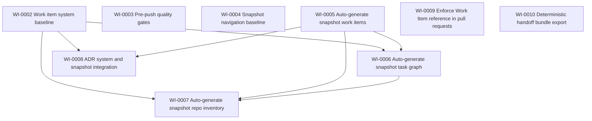
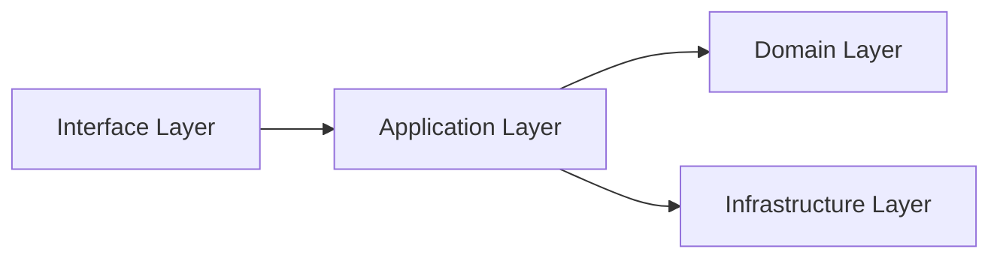

# Context Snapshot

## Purpose
This snapshot is the primary onboarding artifact for a new chat. It should be regenerated frequently and kept current. It is intentionally compact but complete enough to navigate the repository and continue work safely.

## How to use in a new chat
1. Provide this file plus docs/hub/RULES_AND_HANDOFF.md.
2. Add the specific work item objective and the relevant source files if needed.
3. Ask the assistant to restate scope, plan steps, and verification steps before coding.

## Hub navigation
<!-- AUTO:BEGIN hub_navigation -->
Authoritative hub docs:
- Project overview: docs/hub/PROJECT_OVERVIEW.md
- Current state: docs/hub/CURRENT_STATE.md
- Module ownership: docs/hub/MODULE_OWNERSHIP.md
- Executive report: docs/hub/EXECUTIVE_REPORT.md
- Pipeline: docs/hub/PIPELINE.md
- New chat starter: docs/hub/NEW_CHAT_STARTER.md
- Rules and handoff: docs/hub/RULES_AND_HANDOFF.md

Operational shortcuts:
- Snapshot gates: make snapshot-check
- Snapshot regeneration: make snapshot (commit required)
- Handoff bundle: make handoff
<!-- AUTO:END hub_navigation -->

## Snapshot metadata
Generated at: 2026-01-06T13:41:35+00:00
Generator version:
Repository revision: f20a6e9
Working tree status: clean

## Project brief
Name:
One sentence summary:
Primary users:
Primary outcomes:
Non-goals:

## Collaboration profile
This section aligns the chat with the quality bar defined in docs/hub/RULES_AND_HANDOFF.md.
Active profile can be pragmatic or strict.

<!-- AUTO:BEGIN collaboration_profile -->
Active profile: pragmatic

Strict zones (paths or module globs):
- docs/hub/**
- tools/**
- .github/workflows/**

Notes:
- Files inside strict zones always follow the strict gates.
- If strict zones are not yet fully defined for a consuming project, keep placeholders explicit and update them during onboarding.
<!-- AUTO:END collaboration_profile -->

## Current status

What is working:
- Snapshot contract and generators: make snapshot, make validate, and make snapshot-check are stable
- Non-mutating local gates: pre-push checks validate format and detect drift without modifying the working tree
- CI baseline: GitHub Actions runs snapshot quality gates and blocks tracked .ipynb_checkpoints
- PR traceability: CI enforces a WI-0000 style Work Item reference in PR title or PR body
- Deterministic handoff: make handoff produces a tracked-only handoff_bundle.zip and keeps git status clean

What is not working:
- Protected branch rules may not be enforceable on the current GitHub plan for private repositories, so enforcement relies on convention and CI signals
- PR edits may not reliably trigger a new CI run in all cases; a new commit reliably triggers re-evaluation

In progress:
- Hub documentation hardening: PROJECT_OVERVIEW, CURRENT_STATE, MODULE_OWNERSHIP, EXECUTIVE_REPORT, NEW_CHAT_STARTER, RULES_AND_HANDOFF consistency
- Filling remaining placeholders in generated sections (repo inventory, commands, risks) as the project stabilizes

Next actions:
- Fill repo inventory placeholders (entry points, runtime, package manager) and define Commands section content via the generator inputs
- Keep Work Items authoritative: add or update WIs for any new workflow changes and regenerate the snapshot
- Maintain reproducibility: keep snapshot-check green and keep handoff bundle deterministic

## Active work items
<!-- AUTO:BEGIN work_items -->
Format: ID | Title | Status | Owner | Links | Notes
- WI-0002 | Work item system baseline | In progress | You | docs/work_items/WI-0002-work-item-system.md | -
- WI-0004 | Snapshot navigation baseline | In progress | You | docs/work_items/WI-0004-snapshot-navigation.md | -
- WI-0005 | Auto-generate snapshot work items | In progress | You | docs/work_items/WI-0005-auto-work-items-snapshot.md | -
- WI-0006 | Auto-generate snapshot task graph | In progress | You | docs/work_items/WI-0006-auto-task-graph.md | -
- WI-0007 | Auto-generate snapshot repo inventory | In progress | You | docs/work_items/WI-0007-auto-repo-inventory.md | -
- WI-0010 | Deterministic handoff bundle export | Done | You | docs/work_items/WI-0010-deterministic-handoff-bundle.md | -
- WI-0009 | Enforce Work Item reference in pull requests | Done | You | docs/work_items/WI-0009-enforce-wi-reference-in-prs.md | -
- WI-0003 | Pre-push quality gates | Done | You | docs/work_items/WI-0003-pre-push-gates.md | -
<!-- AUTO:END work_items -->

## Task graph
<!-- AUTO:BEGIN task_graph -->

<!-- AUTO:END task_graph -->

## Module graph
<!-- AUTO:BEGIN module_graph -->

<!-- AUTO:END module_graph -->

## Repository inventory
<!-- AUTO:BEGIN repo_inventory -->
Entry points:
- Path: Makefile (Primary local command entry point (make targets))
- Path: tools/snapshot.py (Updates snapshot metadata and the Commands AUTO block)
- Path: tools/check_snapshot_up_to_date.sh (Non-mutating snapshot drift check used by snapshot-check)
- Path: tools/validate_snapshot.py (Validates snapshot formatting contract)
- Path: tools/export_handoff_bundle.sh (Deterministic tracked-only handoff bundle export (make handoff))
- Path: .github/workflows/ci.yml (CI entry point for snapshot and PR WI enforcement)

How to run:
- Command: bash tools/install_git_hooks.sh (Install local git hooks (pre-push))
- Command: make validate (Validate snapshot formatting contract)
- Command: make snapshot-check (Non-mutating drift check and validation (recommended default gate))
- Command: make snapshot (Regenerate snapshot content (commit required if it changes))
- Command: make handoff (Create deterministic tracked-only handoff_bundle.zip)

Key modules:

Module name | Path | Responsibility
---|---|---
docs/hub | docs/hub/ | Authoritative workflow documentation and onboarding artifacts
docs/work_items | docs/work_items/ | Work Items (system of record for work tracking)
docs/adr | docs/adr/ | Architecture Decision Records (decision log)
docs/auto | docs/auto/ | Generated documentation (module graph, task graph, inventory)
tools | tools/ | Generators and quality gates (snapshot, drift checks, handoff)
.github/workflows | .github/workflows/ | CI workflows (snapshot gates, PR WI enforcement, hygiene checks)

Key configuration files:

Path | Purpose
---|---
Makefile | Local commands and workflow targets
.github/workflows/ci.yml | CI: snapshot gates and PR checks
docs/hub/modules.toml | Inputs for repo inventory generation

Dependencies:
- Language and runtime: Python 3.11
- Package manager: pip (via venv/conda is acceptable)
- Core libraries: Python stdlib

Build artifacts excluded:
- venv, .venv, conda envs, node_modules, caches, .ipynb_checkpoints, large data, models, handoff_bundle.zip, repo.zip
<!-- AUTO:END repo_inventory -->

## Commands
<!-- AUTO:BEGIN commands -->
Setup:
- bash tools/install_git_hooks.sh

Run:
- make check

Tests:
- Not configured

Lint:
- Not configured

Type check:
- Not configured

Format:
- Not configured

Snapshot gates:
- make validate
- make snapshot-check

Snapshot regeneration:
- make snapshot

Handoff:
- make handoff
<!-- AUTO:END commands -->

## Interfaces and contracts
<!-- AUTO:BEGIN interfaces -->
Public APIs:
- Name | Location | Contract summary

Data contracts:
- Name | Schema location | Notes

Backward compatibility notes:
- -
<!-- AUTO:END interfaces -->

## Quality gates
This is a concise operational checklist. The authoritative requirements are defined by the active profile and strict zone overrides in docs/hub/RULES_AND_HANDOFF.md.

<!-- AUTO:BEGIN quality_gates -->
Required before merge:
1. Acceptance criteria satisfied
2. Profile gates satisfied (typing, tests, docs) with strict zone overrides
3. Snapshot updated
4. Documentation updated as needed
<!-- AUTO:END quality_gates -->

## Security notes
<!-- AUTO:BEGIN security_notes -->
Threat surfaces:
- -

Known sensitive data:
- -

Security posture:
- No secrets in repo
- Dependency updates policy: TBD
<!-- AUTO:END security_notes -->

## Recent changes
<!-- AUTO:BEGIN recent_changes -->
Last commits or last release notes summary:
- -

Breaking changes:
- None
<!-- AUTO:END recent_changes -->

## Open issues and risks
<!-- AUTO:BEGIN risks -->
Top risks:
- Risk | Likelihood | Impact | Mitigation | Status

Known bugs:
- -
<!-- AUTO:END risks -->

## Decisions

How to add an ADR:
1. Copy docs/adr/_TEMPLATE.md to docs/adr/ADR-XXXX-short-title.md
2. Fill in Date and Status near the top
3. Commit the ADR
4. Run `make snapshot` and commit the updated snapshot

The table below is auto-generated from docs/adr/ADR-*.md.

<!-- AUTO:BEGIN decisions -->
ADR | Title | Date | Status | Link
---|---|---|---|---
ADR-0001 | ADR system and snapshot integration | 2026-01-03 | Accepted | [docs/adr/ADR-0001-adr-system-and-snapshot-integration.md](docs/adr/ADR-0001-adr-system-and-snapshot-integration.md)
<!-- AUTO:END decisions -->

## Glossary
<!-- AUTO:BEGIN glossary -->
Key terms:
- Term: Definition
<!-- AUTO:END glossary -->

## Chat instructions for assistants
1. Do not assume missing context.
2. Propose a plan and verification steps before implementing.
3. Identify active profile and strict zone coverage for touched files before coding.
4. For code changes, always specify module and function, and provide complete updated function bodies.
5. Keep changes small and reversible unless explicitly requested otherwise.
